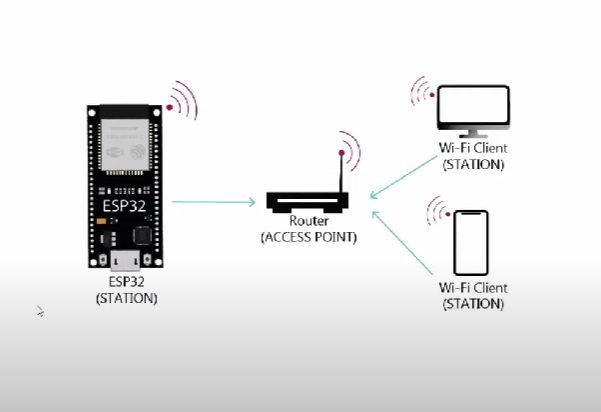

# ESP32-WIFI
connect ESP32 board to wifi 

the architecture of the ESP32 card

<ul>
  <li>open new project in (Arduino.ide )</li>
  <li>add link (file ->preference ->URL->(https://espressif.github.io/arduino-esp32/package_esp32_index.json)</li>
  <li>install esp32 package </li>
</ul>
<h2>ESP32 Features :</h2>
**the ESP32 has 2 wifi modes  
<ul>
  <li>TYPE1: Acces to esp32 through router(STATION ) </li>
  <li>TYPE2: ESP32 setup as ACcess point </li>
</ul>
in this projet i chose type 1:
<h2>Steps :</h2>
-add wifi library :

```
include <wifi.h>
  ```
the built-in wifi.h library will allow us to use the wifi features of the ESP32 board easily 
<h4>photo to explain how to connect ESP32board with wifi </h4> 

When you're working with the ESP32 board to connect to a Wi-Fi network, you need to provide the network's SSID (Service Set Identifier) and password. 
These details allow the ESP32 to connect to the specific Wi-Fi network.

```
const char* ssid = "yourNetworkName";
const char* password = "yourNetworkPassword";
  ```


